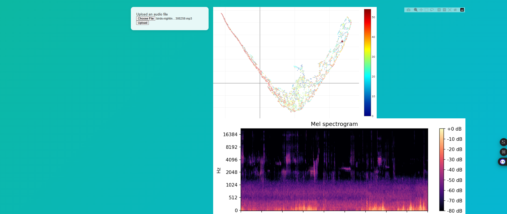

# 🎵 BirdViz – Audio Processing & Visualization

<p align="center">
  
</p>

<p align="center">
  <b>Full-stack web application for audio analysis, spectrograms, and interactive 3D embeddings</b>
</p>

<p align="center">
  
  
  
  
  
  
</p>

---

## ✨ Overview

**BirdViz** is a modern platform for **audio processing and visualization**.  
It allows you to upload audio files and instantly generate:

- 🎧 **MFCCs and spectral features** (centroid, bandwidth, flatness, ZCR)  
- 📊 **Mel-spectrograms** (PNG format)  
- 🌌 **3D embeddings** using UMAP (interactive with Plotly)  
- 🎬 Animated **3D embedding rotation video** (MP4)  

This project combines a **FastAPI backend** with a **React + Plotly frontend** to deliver an interactive and data-rich audio exploration experience.

---

## 📸 Screenshots

<p align="center">
  
</p>

<p align="center">
  
</p>

<p align="center">
  
</p>

---

## 🛠️ Tech Stack

| Layer        | Technologies |
|--------------|--------------|
| **Frontend** | React, Vite, Plotly.js |
| **Backend**  | FastAPI, Uvicorn |
| **Audio**    | Librosa, NumPy, UMAP, Matplotlib |
| **Other**    | CORS, UUID-based file management |

---

## 📂 Project Structure
birdviz/
│
├── backend/
│ ├── app/
│ │ ├── main.py # FastAPI app & routes
│ │ ├── audio_processing.py # Feature extraction & visualization
│ │ ├── models.py # Pydantic models
│ │ └── static/ # Uploaded files & generated outputs
│ └── requirements.txt
│
├── frontend/
│ ├── src/components/ # React components (UploadForm, Visualization)
│ ├── package.json
│ └── vite.config.js
│
├── docs/images/ # Screenshots and banners for README
└── README.md


---

## ⚡ Installation & Setup

### 🔹 Backend (FastAPI)
```bash
cd backend
python -m venv venv
source venv/bin/activate   # Linux/Mac
venv\Scripts\activate      # Windows

pip install -r requirements.txt
uvicorn app.main:app --reload


➡ Open API docs at: http://127.0.0.1:8000/docs

🔹 Frontend (React + Vite)
cd frontend
npm install
npm run dev


➡ Open http://localhost:5173
 in your browser.

📊 Workflow

Upload an audio file (.wav, .mp3, .flac, .ogg).

Backend:

Extracts features (MFCCs, spectral descriptors).

Generates mel-spectrogram (PNG).

Creates UMAP 3D embedding (JSON + MP4).

Frontend:

Displays interactive Plotly graphs.

Shows spectrogram and animation links.

📡 API Usage
POST /process
curl -X POST "http://127.0.0.1:8000/process" \
  -F "file=@example.wav"


Response example:

{
  "sr": 44100,
  "times": [...],
  "mfcc": [...],
  "embedding": [...],
  "spectrogram_image": "/static/outputs/abc123_mel.png",
  "embedding_video": "/static/outputs/abc123_3d.mp4",
  "audio_file": "/static/uploads/abc123.wav"
}

🎯 Roadmap

 Batch uploads for datasets

 Add more audio features (chroma, tempo, onset)

 Export data as CSV/JSON

 User authentication & dashboards

 Dark / light mode toggle on frontend

🤝 Contributing

Contributions, issues, and feature requests are welcome!
Feel free to open a PR or issue.

📜 License

MIT License © 2025 – Built with ❤️ using FastAPI & React

<p align="center">  </p> ```